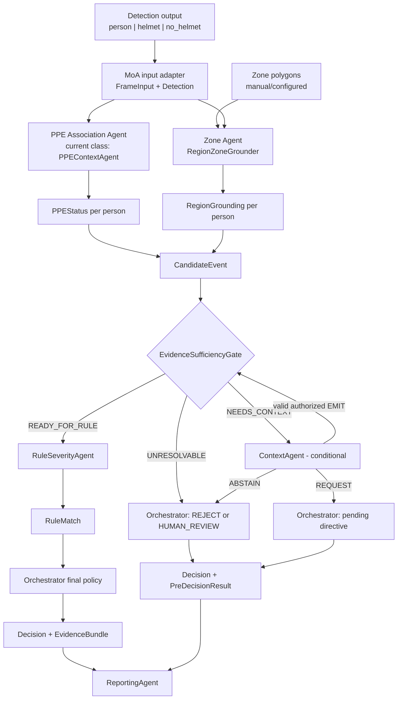

# Research Project Context: Controlled MoA for Construction Safety Monitoring

> Updated from the workspace state on 2026-08-18. This is the project-wide working context for the complete research project under `D:\Dai Hoc\NKKH`. The `construction-safety-reporting-moa` repository is one implementation workstream within the project, not the boundary of this document. This document is not a verbatim copy of the proposal.

## 1. Purpose and source precedence

This document keeps analysis, implementation, tests, data creation, and future MoA work consistent. When sources conflict, use the following order of precedence:

1. The user's latest direct clarification.
2. Code, tests, and documentation in the current working tree, including uncommitted changes.
3. The latest Git commits and previously verified working decisions.
4. The proposal and older introductory documents.

The proposal describes a broader research direction. It must not be used to expand implementation scope automatically. Older ideas such as multiple PPE types, a Behavior Agent, BIM, temporal reasoning, equipment proximity, or field deployment remain future directions unless a newer clarification explicitly brings them into scope.

### Current clarifications that supersede older material

- The baseline has been updated in the main repository but is not present in this checkout yet. The user will pull and merge it later. Do not reconstruct or infer missing baseline contracts or metrics before that merge.
- The confirmed baseline detection labels are exactly `person`, `helmet`, and `no_helmet`.
- The baseline currently has its own logic for identifying which area a person is in. In the MoA architecture, this responsibility belongs exclusively to the Zone Agent.
- A `person` bounding box is mandatory for PPE association and zone grounding. Missing `person` input must fail closed. A `helmet` or `no_helmet` bounding box must not be used as a worker proxy in the current flow.
- The current focus is limited to the person's zone and whether the person is wearing a helmet.
- Vest, mask, harness, glove, footwear, behavior, motion, identity recognition, and BIM are not currently in scope.
- Benchmark design and comparative conclusions are not required at this stage.

## 2. Research project goal, workstreams, and current scope

The complete research project studies a controlled, region-grounded Mixture-of-Agents system for construction-safety monitoring and reporting. The project contains both the updated baseline and the Controlled MoA. The immediate phase is to establish the correct project architecture and non-overlapping agent boundaries for the `person + helmet/no_helmet + zone` flow. Benchmark construction, comparison metrics, and claims that MoA outperforms the baseline are deferred until the updated baseline is merged and the user reopens the evaluation scope.

### Project workstreams

1. **Updated baseline workstream:** owns its detector and baseline-only processing. The confirmed detector labels are `person`, `helmet`, and `no_helmet`. The baseline currently also has its own person-area processing. Its latest implementation remains in the main repository and will be pulled/merged later.
2. **Controlled MoA workstream:** consumes structured perception evidence and performs person-PPE association, person-zone grounding through the Zone Agent, evidence routing, conditional Context, helmet-zone rule matching, final orchestration, and structured reporting.
3. **Context vision pilot:** evaluates whether a local VLM can contribute bounded evidence without bypassing typed validation or fail-closed routing. It remains experimental.
4. **Evaluation and reporting workstream:** will eventually compare the baseline and MoA and assess report quality, but benchmark design is deliberately deferred for now.

### In scope for the current project phase

- Preserve the updated baseline as a first-class project component and integrate its latest version after the user pulls/merges it.
- Consume `person`, `helmet`, and `no_helmet` detections in the MoA path.
- Associate each `helmet` or `no_helmet` detection with the correct `person`.
- Determine which zone contains each person in the MoA path using the Zone Agent, the person's bounding box, and configured zone polygons.
- Create one `CandidateEvent` per person.
- Check evidence completeness and consistency through a deterministic, fail-closed gate.
- Retain Context Agent and invoke it only when the Gate identifies recoverable ambiguity and grants a specific action capability.
- Apply helmet-zone rules, produce candidate severity, make a controlled final decision, and generate a structured report.
- Keep baseline and MoA responsibilities separate so project-wide comparisons can be designed later without sharing hidden decision logic.

### Outside the current phase or not yet decided

- Reconstructing, retraining, or changing the updated baseline before its latest main-repository version is pulled and reviewed. Baseline development remains part of the overall project, but not an inferred task for the current checkout.
- Adding detector classes beyond `person`, `helmet`, and `no_helmet`.
- A Behavior/Temporal Agent, activity recognition, identity tracking, or face recognition.
- Crane, vehicle, or equipment proximity. Whether this feature will be implemented has not been decided. It must not be added, removed, or allowed to affect the current primary flow without a separate decision.
- BIM/digital twins, automatic zone generation, end-to-end video ingestion, or automatic execution of crop/frame acquisition loops.
- Allowing a VLM to decide violation, severity, alerts, human review, or report content.
- Designing or concluding a benchmark, or making field-ready, production-ready, or validated-model claims without experimental evidence.

## 3. Canonical MoA architecture

This canonical view shows only the Controlled MoA path. Baseline details remain part of the wider research-project context but are intentionally excluded from this architecture diagram. The MoA starts from structured `person`, `helmet`, and `no_helmet` detections plus configured zone polygons. Person-zone grounding belongs only to the Zone Agent, while the Controlled Orchestrator owns the complete routing flow and the final decision.



### Canonical MoA flow for one person

1. The detector branch of the baseline provides one `person` detection and any potentially associated helmet detections.
2. The PPE Agent associates helmet evidence with the `person_id` and creates `PPEStatus`.
3. The Zone Agent uses the `bottom_center` of the `person` bounding box to find the containing polygon and creates `RegionGrounding`.
4. The Orchestrator joins outputs with the same `target_id` into a `CandidateEvent`.
5. The Gate returns exactly one route: `READY_FOR_RULE`, `NEEDS_CONTEXT`, or `UNRESOLVABLE`.
6. Rule runs only for `READY_FOR_RULE`. Context runs only for `NEEDS_CONTEXT` with actions authorized by the Gate.
7. The Orchestrator creates the final status and alert level. Reporting only serializes validated evidence.

## 4. Core input contract

### 4.1 Detections from the baseline

Each detection contains:

- `object_id`: a unique ID within the frame.
- `class`: one of `person`, `helmet`, or `no_helmet`.
- `bbox`: `[x1, y1, x2, y2]` in image coordinates.
- `confidence`: a value in `[0, 1]`.
- `attributes`: optional metadata that must not be treated as fact without an explicit contract.

Minimal example:

```json
{
  "frame_id": "F001",
  "timestamp": "00:00:01.00",
  "source": "frame_001.jpg",
  "detections": [
    {"object_id": "P01", "class": "person", "bbox": [100, 80, 220, 420], "confidence": 0.94},
    {"object_id": "H01", "class": "helmet", "bbox": [135, 82, 180, 128], "confidence": 0.91}
  ]
}
```

Mandatory rules for new data:

- Every event must have one `person` detection as its target.
- `helmet` and `no_helmet` are separate bounding-box detections.
- Helmet detections must have evidence IDs distinct from the person ID. They are associated with a person through normalized geometry or an explicit association field; IDs must not be reused ambiguously.
- If the same person has both `helmet` and `no_helmet` evidence, the normalized state is `uncertain` with a recorded conflict. The system must not silently select the higher-confidence label.
- If `person` is missing, the input must fail closed. There is no fallback to a head/PPE bounding box in the current flow.

### 4.2 Zones

Each zone contains `zone_id`, `zone_type`, `polygon`, `confidence`, and `rule_source`. Zones are currently supplied through manual configuration. The Zone Agent does not detect or invent zone names.

Zone types supported by the current rule/gate contract:

- PPE-required: `active_work_area`, `restricted_zone`, `work_at_height`.
- PPE-exempt or downgraded: `site_office`, `rest_area`.
- Unresolved: `unknown`.

`material_handling` appears in the old grounder priority list but is not included in `SUPPORTED_ZONE_TYPES`. Do not use it in official data until the Gate, rule catalog, and tests are updated together.

### 4.3 Processing unit

The reasoning unit is one person in one frame or clip: `event_id + worker_id/person_id + frame_ref + crop_ref`. A frame containing multiple people must not produce one combined decision for the entire frame.

## 5. Component responsibilities and boundaries

### 5.1 Updated Baseline Workstream - inside the research project, outside the MoA

**Input:** an image or video frame preprocessed by the baseline pipeline.

**Confirmed output:** `Detection` records for exactly `person`, `helmet`, and `no_helmet`, including bounding boxes and confidence. Other contract details must be updated only after the baseline from the main repository is pulled and merged.

**Processing:** the baseline has its own path for detecting the three classes and currently includes logic for identifying which area contains a person. When the corresponding function is performed inside the MoA, the Zone Agent is its sole owner. The MoA must not call the baseline's zone logic as a hidden agent.

**Project boundary:** the baseline is a complete research-project workstream, not merely an external dependency. However, it does not own the PPE Agent, Zone Agent, Rule Agent, final decision, or reporting contracts inside the MoA path.

### 5.2 PPE Association Agent

**Current implementation name:** `PPEContextAgent`. This is a legacy name. Its actual responsibility is PPE association and normalization only. The word "Context" in the class name does not grant scene-analysis authority.

**Input:** `FrameInput` containing `person`, `helmet`, and `no_helmet` detections.

**Output:** `dict[person_id, PPEStatus]` containing:

- `helmet`: `visible`, `missing`, `uncertain`, or `unknown`.
- `confidence`.
- `target_id`: exactly the `person_id`.
- `evidence_detection_ids`.
- `conflicts` and `notes`.

**Only responsibilities:**

- For each `person`, find `helmet` or `no_helmet` evidence in the head region of the person's bounding box.
- Normalize that evidence into the helmet state of the correct person.
- Preserve conflicts instead of resolving them through unsupported inference.

**Must not:** detect new people, determine zones, read the rule catalog, assign severity, decide alerts, call a VLM, or write reports.

### 5.3 Region/Zone Grounding Agent

**Implementation name:** `RegionZoneGrounder`.

**Input:** `FrameInput` containing `person` bounding boxes and the list of configured `Zone` polygons for the frame.

**Output:** `dict[person_id, RegionGrounding]` containing `zone_id`, `zone_type`, `spatial_relation`, `confidence`, `target_id`, `rule_source`, and `anchor_point`.

**Only responsibilities:**

- Use the `bottom_center` of each `person` bounding box as the person's ground/footpoint anchor.
- Determine which polygon contains that point.
- If polygons overlap, apply a configured deterministic priority. Do not use free-form reasoning to choose a zone.
- Return `inside` with the selected zone, or `unknown` when no valid zone is available.

**Current spatial labels:** only `inside` and `unknown`. Do not introduce `near`, `crossing`, `approaching`, or behavior inference.

**Must not:** assess helmets, decide whether a zone is dangerous, assign violation or severity, modify detections, or generate reports.

### 5.4 Evidence Sufficiency Gate - deterministic control, not an agent

**Implementation name:** `EvidenceSufficiencyGate`.

**Input:** one `CandidateEvent` joined by the same `person_id`.

**Output:** `EvidenceGateResult` containing route, reason codes, missing fields, recoverability, and `allowed_context_actions`.

**Only responsibility:** validate structure, IDs and references, confidence, conflicts, supported zones, evidence issues, and Context attempt budget. The Gate does not call a model and does not create a final decision.

**Routes:**

- `READY_FOR_RULE`: evidence is complete and consistent.
- `NEEDS_CONTEXT`: ambiguity is recoverable through a declared capability.
- `UNRESOLVABLE`: the structure is invalid, evidence is insufficient or unrecoverable, the zone is unsupported, or the budget is exhausted.

**Must not:** create `HUMAN_REVIEW`, `REJECT`, `RuleMatch`, severity, or reports. Final directives belong to the Orchestrator.

### 5.5 Context Agent - conditional, not the default path

**Implementation name:** `ContextAgent`. Its default adapter remains `UnconfiguredContextModelAdapter` and fails closed.

**Input:** `ContextRequest`, only after the Gate returns `NEEDS_CONTEXT`, normalized PPE/zone evidence is present, and `allowed_context_actions` is non-empty.

**Output:** one validated `ContextResult` with exactly one action:

- `EMIT_CONTEXT_EVIDENCE`.
- `REQUEST_HIGHER_RESOLUTION_CROP`.
- `REQUEST_MORE_FRAMES`.
- `ABSTAIN`.

**Processing:** assess additional evidence only within authorized references; validate actions, labels, subject/object IDs, frame/crop/zone references, and confidence. Only `CONFIRMED` evidence selected by a valid `EMIT` can be merged, after which the Gate must run again.

**Mandatory boundaries:**

- Must not change `PPEStatus`, `RegionGrounding`, upstream confidence, or `person_id`.
- Must not assign a person to a zone instead of the Zone Agent in a clear case.
- Must not detect new objects, decide violation or severity, create alerts or human review, or write reports.
- `REQUEST_*` is only a pending directive and does not prove that media was acquired.
- `ABSTAIN` must not create a fabricated `RuleMatch`.

**Latest P0 status:** a resolver, local llama.cpp adapter, and weight-free harness exist in the working tree. Qwen3-VL-2B-Instruct-GGUF has been selected as the pilot model. The real VLM pilot has not run, weights and licensed media are absent, and the model has not been experimentally validated. The Context Agent remains part of the architecture. The relation/equipment branch of the pilot is experimental and is not part of the current primary person-helmet-zone flow.

### 5.6 Rule/Severity Agent

**Implementation name:** `RuleSeverityAgent`.

**Input:** `CandidateEvent` and an `EvidenceGateResult` whose route is exactly `READY_FOR_RULE`.

**Output:** `RuleMatch` containing `rule_id`, `violation`, `severity`, `confidence`, `recommended_action`, `reason`, `uncertainty`, `reason_codes`, `evidence_refs`, and `missing_evidence`.

**Only responsibility:** map `PPEStatus + RegionGrounding + permitted confirmed context evidence` to the rule catalog. Every emitted rule ID, description, and action must exist in `data/rules.json`.

**Must not:** inspect raw images to discover facts, rewrite PPE or zone evidence, run before the route is ready, create final status or alert level, request media, or write reports.

### 5.7 Controlled Orchestrator/Auditor

**Implementation name:** `ControlledMoAOrchestrator`.

**Input:** frame data, agent outputs, Gate results, an optional Context result, and the selected runtime mode.

**Output:** a list of `Decision` records. Each decision contains exactly one evidence path:

- `EvidenceBundle` with a real `RuleMatch`; or
- `PreDecisionResult` for pending, review, or rejection, with no fabricated rule.

**Exclusive responsibilities:**

- Join outputs by the same `person_id` and create `CandidateEvent`.
- Control routing and the Context attempt budget.
- Merge only authorized Context evidence and then rerun the Gate.
- Invoke Rule only for `READY_FOR_RULE`.
- Convert unresolved states into `HUMAN_REVIEW` or `REJECT`.
- Decide the final `status` and `alert_level`.

**Must not:** redetect people or PPE, determine zones itself, invent rules or evidence, or add report prose beyond validated evidence.

### 5.8 Reporting Agent

**Implementation name:** `ReportingAgent`.

**Input:** a final `Decision` from the Orchestrator.

**Output:**

- `rule_decision` for a decision with a real `EvidenceBundle` and `RuleMatch`.
- `pre_decision` for pending, human review, or rejection.
- A package containing `daily_log`, `email_summary`, `critical_alerts`, and `human_review_queue`.

**Only responsibility:** serialize approved fields and group reports by alert level.

**Must not:** decide violation, severity, zone, or action policy; add identity, location, cause, equipment, or recommendations not present in evidence or the rule catalog.

## 6. Ownership matrix for preventing overlap

| Capability | Sole owner inside the relevant path | What other components may do |
| --- | --- | --- |
| Detect `person`, `helmet`, `no_helmet` | Updated baseline workstream | MoA components read existing detections only |
| Associate helmet evidence with a person and normalize helmet state | PPE Association Agent | Gate validates; Rule consumes |
| Determine which area contains a person in the baseline path | Baseline workstream's area-location module | Must remain isolated from MoA agent ownership |
| Determine which zone contains a person inside the MoA path | `RegionZoneGrounder` | Gate validates; Rule consumes |
| Decide whether evidence is sufficient to continue | `EvidenceSufficiencyGate` | Orchestrator executes the route |
| Propose additional evidence for authorized ambiguity | `ContextAgent` | Gate and Orchestrator validate and merge |
| Map evidence to a candidate rule and severity | `RuleSeverityAgent` | Orchestrator makes the final decision |
| Final status, alert, pending, review, or rejection | `ControlledMoAOrchestrator` | Reporting only serializes |
| Structured report output | `ReportingAgent` | No other agent writes reports |

If a change gives two components ownership of the same row, reject the change or split and redefine the contracts before merging it.

## 7. Canonical labels and states

### 7.1 Core labels

- Detection class: `person`, `helmet`, `no_helmet`.
- PPE state: `visible`, `missing`, `uncertain`, `unknown`.
- Zone type: `active_work_area`, `restricted_zone`, `work_at_height`, `site_office`, `rest_area`, `unknown`.
- Spatial relation for the current scope: `inside`, `unknown`.
- Evidence route: `READY_FOR_RULE`, `NEEDS_CONTEXT`, `UNRESOLVABLE`.
- Severity: `none`, `medium`, `critical`, `uncertain`. Use `low` only if a future rule catalog and ground truth define it explicitly.
- Decision status: `accepted`, `downgraded`, `no_alert`, `pending`, `escalated`, `rejected`.
- Alert level: `none`, `daily_log`, `email_summary`, `critical_alert`, `human_review`.
- Report stage: `rule_decision`, `pre_decision`.

### 7.2 Context labels - experimental and conditional

- Evidence issue: `LOW_RESOLUTION`, `TARGET_TOO_SMALL`, `LOW_LIGHT`, `OCCLUDED`, `RELATION_UNCLEAR`, `TEMPORAL_CONTEXT_INSUFFICIENT`, `BOUNDARY_STATE_UNCLEAR`, `FRAME_ERROR`.
- Evidence kind: `VISUAL_QUALITY`, `LOCAL_RELATION`, `INPUT_CONFIDENCE`.
- Evidence status: `CONFIRMED`, `PROVISIONAL`.
- Context action: `EMIT_CONTEXT_EVIDENCE`, `REQUEST_HIGHER_RESOLUTION_CROP`, `REQUEST_MORE_FRAMES`, `ABSTAIN`.
- Local relations currently present in the contract: `NEAR`, `ADJACENT`, `OVERLAPPING`, `OCCLUDED_BY`, `RELATION_UNCLEAR`, `BOUNDARY_STATE_UNCLEAR`.

Local-relation labels must not be introduced automatically into the current primary flow. In particular, `NEAR` equipment and the related severity upgrade are existing experimental logic. Whether to continue implementing this feature remains an open decision. It must not affect person-helmet-zone decisions now. Under the current three-class detector contract, there is no valid equipment detection to support such evidence, so the `NEAR` equipment branch must not activate Rule.

## 8. Core helmet-zone rules

| Helmet state | Zone | Candidate result |
| --- | --- | --- |
| `visible` | Any supported zone | No violation; severity `none` |
| `missing` | `site_office` or `rest_area` | No alert; may be `downgraded` or retained in a daily audit log |
| `missing` | `active_work_area` | Violation; severity `medium` |
| `missing` | `restricted_zone` or `work_at_height` | Violation; severity `critical` |
| `uncertain` or `unknown` | Any zone | Rule does not run in the controlled flow; the Gate fails closed |
| Any state | `unknown` or unsupported | Rule does not run; the Orchestrator selects human review or rejection |

Do not infer a rule from one raw detection class without a valid `person_id`, PPE association, and zone grounding.

## 9. Project integration and evaluation status

The updated baseline is a first-class component of the research project. Its latest implementation is in the main repository and will be pulled and merged later by the user. The current project workspace does not yet contain enough evidence to describe the complete updated baseline pipeline, artifacts, or metrics. Older two-class descriptions and old metrics in the proposal or HTML must not be treated as the upcoming merged version.

The following modes still exist in the Controlled MoA workstream, but they are implementation history rather than an approved project-wide benchmark design:

| Mode | Current behavior in the Controlled MoA workstream |
| --- | --- |
| `yolo_only` | Legacy branch that creates alerts directly from normalized `no_helmet` state |
| `single_reasoning` | Applies lighter rule logic without the full controlled routing contract |
| `uncontrolled_moa` | Accepts risky or uncertain outputs with weaker control gates |
| `controlled_moa` | Main person-level association, zone grounding, Gate, conditional Context, Rule, and final Orchestrator flow |

No benchmark is designed at this time. Do not finalize test splits, metrics, comparison modes, or conclusions until the updated baseline is merged and the user confirms the evaluation scope. `data/baseline_metrics.json` and the seven current synthetic samples are historical or contract-smoke data; they do not represent the updated baseline.

## 10. Project implementation status and synchronization gaps

### Updated baseline workstream

- The user confirms that the main repository contains the updated baseline.
- Its confirmed detection classes are `person`, `helmet`, and `no_helmet`.
- It currently has baseline-side processing for identifying which area contains a person.
- The latest baseline implementation has not yet been pulled/merged into this workspace, so further implementation and metric details remain intentionally unspecified.

### Controlled MoA workstream already present in code

- `PPEContextAgent` already accepts `person`/`worker`, associates helmet evidence with the head region, and produces `PPEStatus` by person ID.
- `RegionZoneGrounder` already prioritizes person bounding boxes and uses `bottom_center` for polygon membership.
- Typed `CandidateEvent`, the deterministic Gate, closed Context actions, a fail-closed Rule contract, `EvidenceBundle`/`PreDecisionResult`, the Orchestrator, and Reporting are implemented.
- Controlled Rule runs only for `READY_FOR_RULE`; `REQUEST_*` and `ABSTAIN` do not create fake rules.
- The optional local Context vision harness is implemented, but the real pilot has not run.

### Cross-project synchronization gaps

- `data/sample_detections.json` still contains only `helmet` and `no_helmet`; it has no separate person bounding boxes.
- README and architecture documents still describe the sample as using a head/PPE bounding box as a worker proxy.
- A head-level fallback still exists in code. The current controlled flow must instead fail closed when `person` is missing.
- Equipment classes, `NEAR` relations, and equipment-based severity upgrades remain in historical code. Whether to keep, remove, or continue implementing them is an open decision. They must not affect the current primary flow.
- `material_handling` exists in the zone priority list but is unsupported by the Gate and rule contract.
- The updated baseline in the main repository has not been pulled or merged into the project workspace.

These are synchronization gaps. Do not hide them by describing the target architecture as if it were already fully implemented or evaluated.

## 11. Acceptance rules for future changes

A change is consistent with this context only when all relevant conditions are satisfied:

- Every official decision traces back to one `person` detection and one `person_id`.
- Missing `person` input fails closed; a head/PPE bounding box is never used as a substitute target.
- PPE and zone outputs have the same `target_id`; mismatches fail closed.
- Person-zone grounding uses the `bottom_center` of the person bounding box and a declared polygon.
- No agent modifies output owned by another agent.
- The Gate does not call a model or create a final directive.
- Context runs only for `NEEDS_CONTEXT` and uses only Gate-authorized actions.
- Rule runs only for `READY_FOR_RULE`, and every rule ID exists in the catalog.
- Only the Orchestrator creates final status, alerts, review, or rejection.
- Reporting adds no claims beyond validated evidence and rules.
- New labels or agents are not added without updating the data contract, ownership model, rules, tests, and this document together.
- Do not design a benchmark before the updated baseline is merged and the user confirms the evaluation scope.
- Passing tests do not constitute field validation. A fake VLM smoke run does not constitute model validation.

## 12. Source used to build this project context

- Project proposal: `Research_Proposal_MoA_Smart_Construction.md`.
